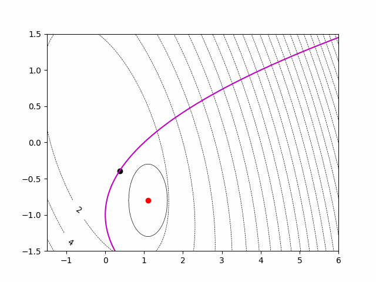
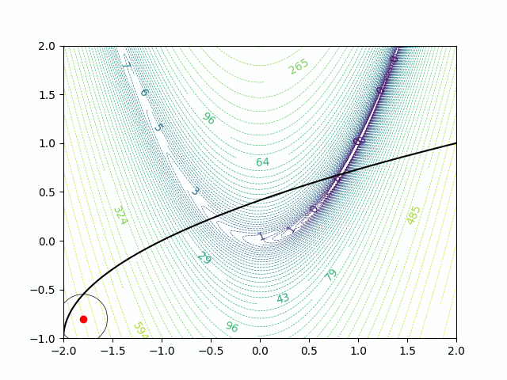

# Real-Time-Optimization-with-Bayesian-Optimization

Repository on making Safe Bayesian Optimization for Real Time Optimization

Result for solving Benoit Problem:

Result for solving Rosenbrock Problem:

Source:
[Gaussian Process from Scratch](https://github.com/AntonioE89/Gaussian-Process-from-scratch)

[ Optimisation and Machine Learning for Process Systems Engineering](https://www.imperial.ac.uk/optimisation-and-machine-learning-for-process-engineering/about-us/)

[OptiML PSE Lab](https://github.com/OptiMaL-PSE-Lab)