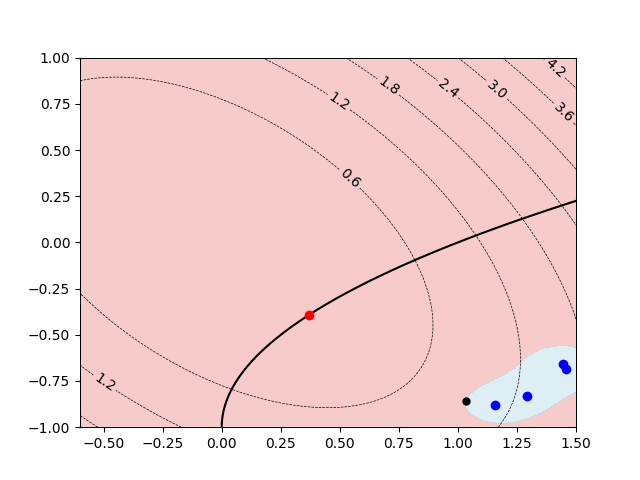
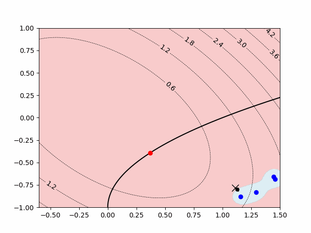

# Real-Time-Optimization-with-Bayesian-Optimization

Repository on making Safe Bayesian Optimization for Real Time Optimization

SafeOpt with Benoit Problem:

GoOSE with Benoit Problem:

StableOpt with Benoit Problem:

Source:

[Gaussian Process from Scratch](https://github.com/AntonioE89/Gaussian-Process-from-scratch)

[Optimisation and Machine Learning for Process Systems Engineering](https://www.imperial.ac.uk/optimisation-and-machine-learning-for-process-engineering/about-us/)

[OptiML PSE Lab](https://github.com/OptiMaL-PSE-Lab)

[Safe Exploration for Optimization with Gaussian Processes (Sui et al., 2015)](https://proceedings.mlr.press/v37/sui15.html)

[Safe Exploration for Interactive Machine Learning (Turchetta et al., 2019)](https://proceedings.neurips.cc/paper_files/paper/2019/hash/4f398cb9d6bc79ae567298335b51ba8a-Abstract.html)
